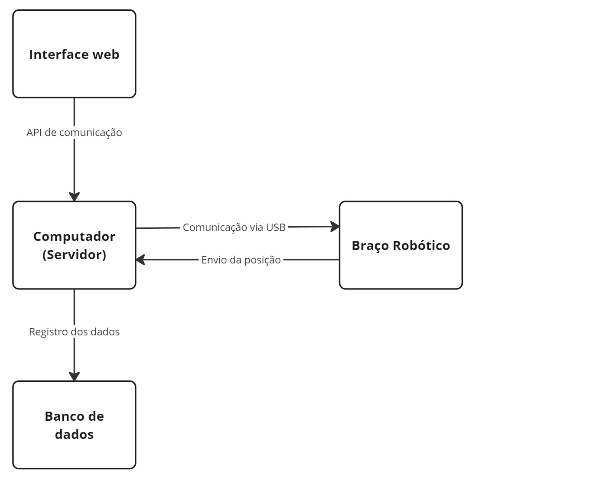

A finalidade do diagrama de blocos nesta fase inicial é fornecer uma visão geral do funcionamento da solução. À medida que as sprints forem passando, é possível esperar mais refinamentos e ajustes ao diagrama para refletir com mais precisão o desenvolvimento contínuo da solução.

