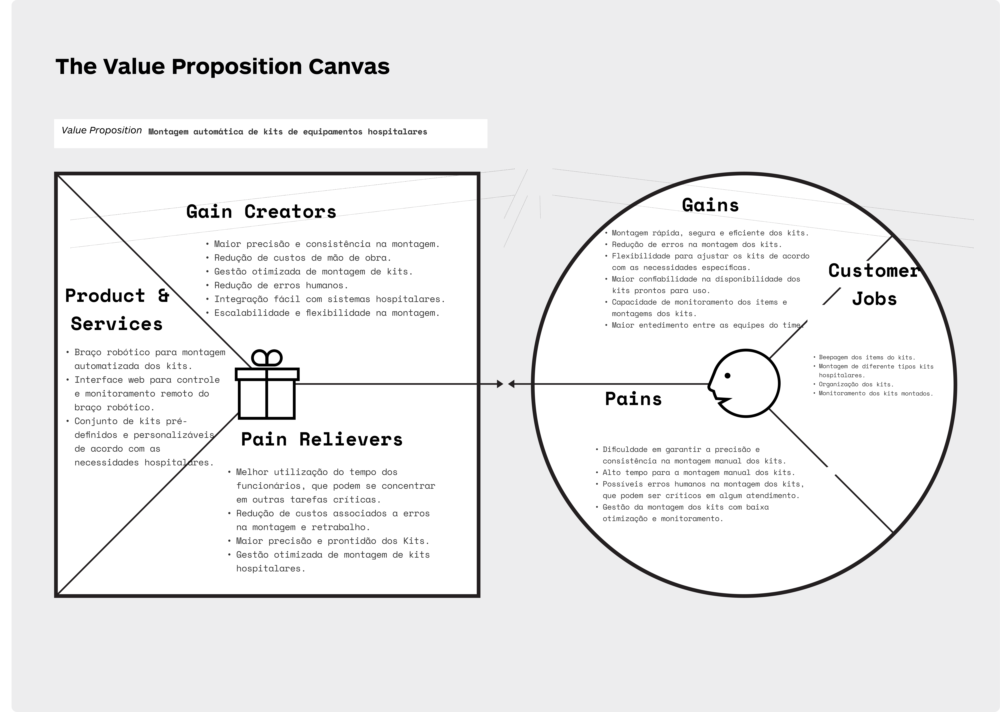

# Sobre o nosso projeto: 

## Canvas Proposta de valor

A seguir vamos apresetar o Vlaue Proposition Cavas ou Canvas Proposta de Valor (CPV) do projeto. O CPV é uma ferramenta estratégica no mundo de negócios que é utilizada para compreender e explicar a proposta de valor de um produto ou serviço. Ele fornece uma estrutura visual para analisar e descrever como um produto ou serviço satisfaz as necessidades, dores e ganhos dos clientes. Espeficamente nesse projeto, o VPC está sendo empregado como uma ferramenta entender melhor a proposta de valor do nosso sistema de montagem automatizada de kits hospitalares.

Na parte do perfil do cliente, vemos que a área de farmacia, respovsável pela montagem dos kits, têm uma necessidade crítica de montar kits de equipamentos hospitalares de forma rápida, segura, precisa e eficiente para garantir prontidão e qualidade no atendimento dos médicos. As principais dores enfrentadas pelos hospitais foram as dificuldade em garantir precisão e consistência na montagem manual dos kits, o tempo necessário para essa atividade, risco de erros humanos e dificuldade na gestão e montiramento da montagem desses kits devido a troca de turnos de equipes no hospital. Além disso, reconhecemos que os hospitais buscam ganhos como montagem rápida e eficiente dos kits, redução de erros, flexibilidade na customização dos kits e maior confiabilidade na disponibilidade dos mesmos.

Já na parte do valor da solução, desenvolvemos um sistema de montagem automatizada de kits hospitalares, equipado com um braço robótico e uma interface web de controle e monitoramento. O sistema oferece ganhos significativos para os hospitais, proporcionando precisão e consistência na montagem dos kits, reduzindo o tempo necessário para a montagem, eliminando erros humanos, permitindo controle remoto e customização flexível dos kits.