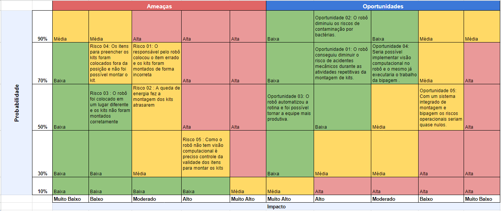

A matriz de risco tem como objetivo identificar riscos e oportunidades que foram encontradas em relação ao projeto.

Na seção de riscos, é importante observar que os maiores desafios derivam de erros humanos, seja ao posicionar o robô em uma posição fora do padrão, selecionar os itens inadequados para a montagem, ou negligenciar a verificação da validade. Um ponto crucial a lembrar é que o projeto não inclui visão computacional; portanto, o posicionamento dos itens deve sempre seguir um padrão fixo para garantir o funcionamento correto do robô.

Quanto às oportunidades, o robô pode reduzir o trabalho manual repetitivo, diminuir os riscos de acidentes e contaminação. Além disso, há a perspectiva de implementar, no futuro, visão computacional e verificação individual de cada produto antes da montagem do kit. 

A figura abaixo demonstra os riscos e oportunidades que foram encontrados durante o desenvolvimento do projeto. 

