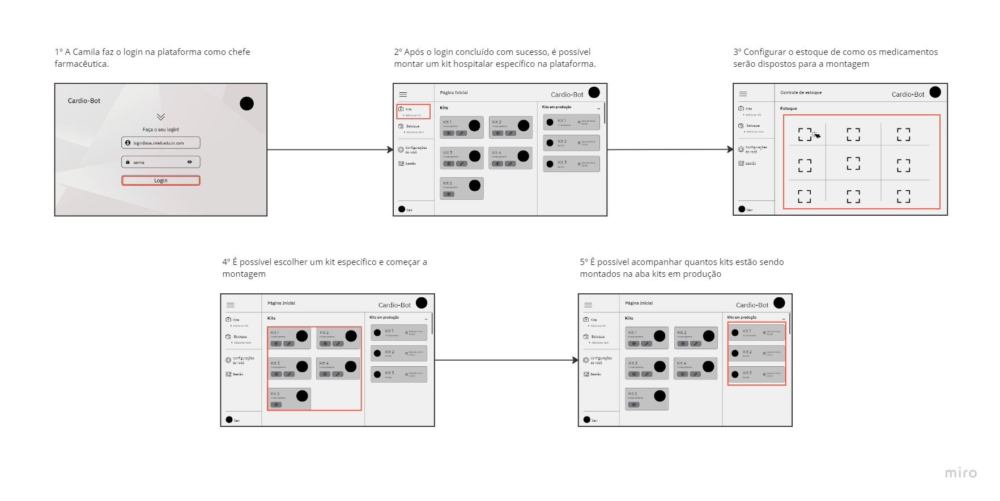
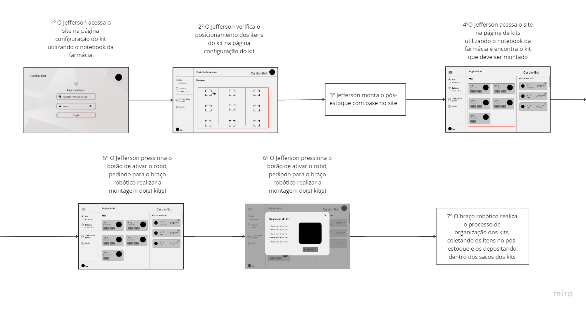

import ReactPlayer from 'react-player'
import MyVideoUrl from '../../../static/video/ExecucaoRoboBlocos.mp4';

# Mapeamento do Fluxo de Utilização da Solução

## 1. Introdução

Nesta seção iremos descrever o fluxo de utilização da solução, que é uma representação visual das etapas e a sequência de ações que as personas realizarão ao utilizar a solução. O fluxo de utilização da solução é fundamental para entender como cada usuário irá interagir de forma prática com o software desenvolvido. Esse mapeamento será feito com base nas personas definidas na [seção de personas](../../Sprint%201/user_expirience/personas.md) e será utilizados as imagens do wireframe para ilustrar as interações que estão sendo feitas pelo usuário.

A compreensão do fluxo de utilização da solução é fundamental para entender como cada usuário irá interagir de forma prática com o software desenvolvido. Este fluxo delineia as etapas e a sequência de ações que as personas realizarão ao utilizar a solução. Ao compreender esse fluxo, é possível aprimorar a experiência do usuário, garantindo que o software atenda às necessidades específicas de cada perfil e otimize sua usabilidade.

## Fluxo de Utilização da Solução - Persona: Camila

## Fluxo de Utilização da Solução - Persona: Jefferson

Para representar a ação 7 do fluxo de utilização da solução para a persona Jefferson, colocamos um vídeo demonstrativo de como seria a execução do robô montando os kits.

<ReactPlayer playing controls url={MyVideoUrl} />
