<h2> Apresentação dos wireframes </h2>

<h3>Versão Desktop</h3>

Tela 1 - Login

Fonte: Elaborado pela equipe Cardio-Bot

Tela 2 - Página Inicial

Fonte: Elaborado pela equipe Cardio-Bot

Tela 3 - Descrição do kit e confirmação dos dados

Fonte: Elaborado pela equipe Cardio-Bot

Tela 4 - Editar Kit

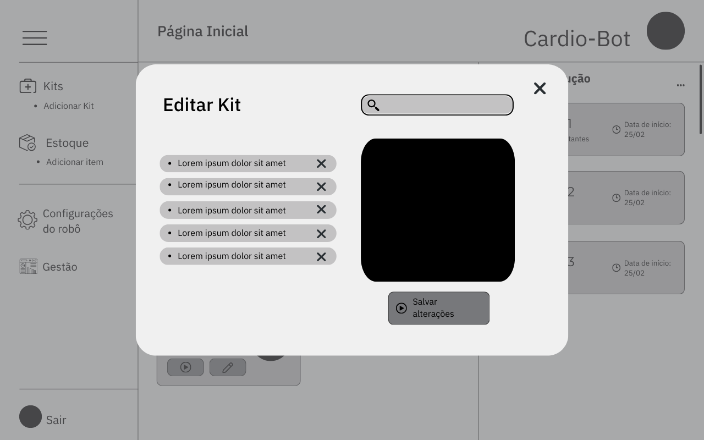

Fonte: Elaborado pela equipe Cardio-Bot

Tela 5 - Adicionar Kit

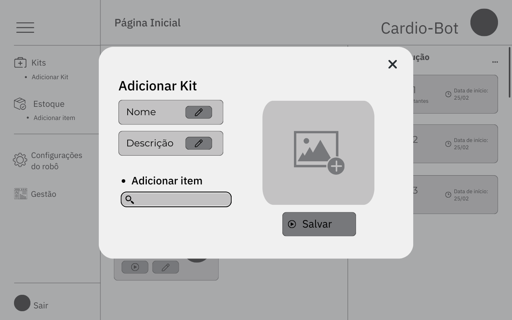

Fonte: Elaborado pela equipe Cardio-Bot

Tela 6 - Controle de Estoque

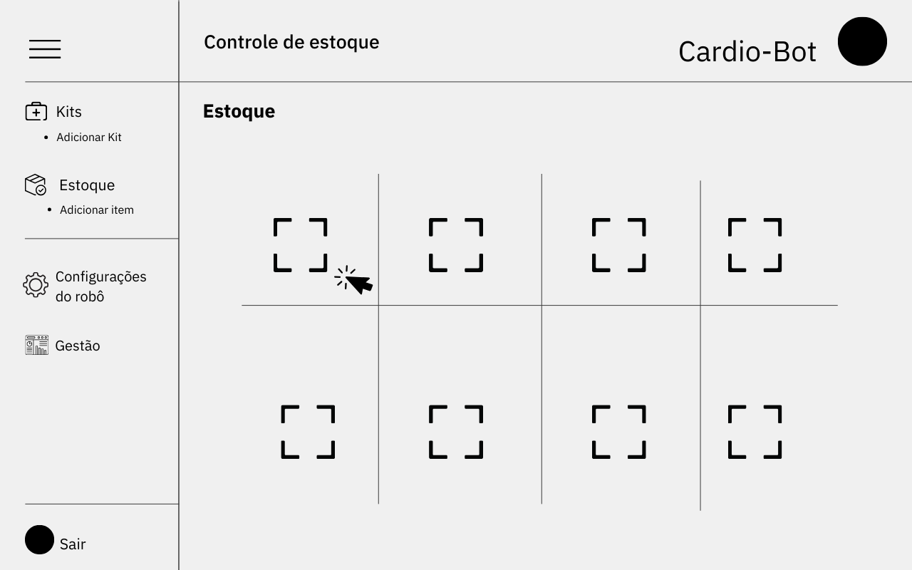

Fonte: Elaborado pela equipe Cardio-Bot

Tela 7 - Editar componente do estoque

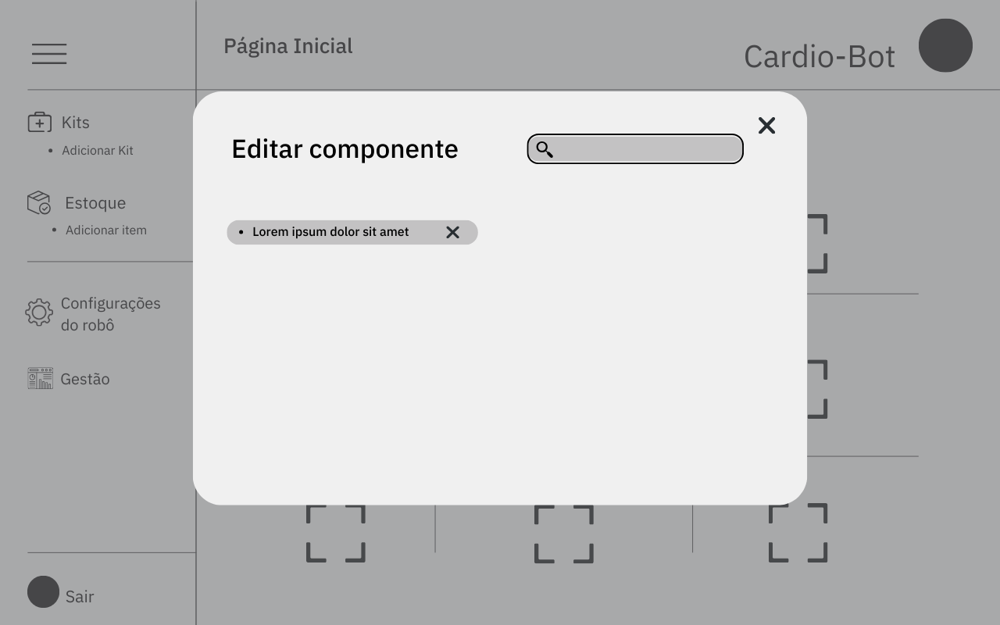

Fonte: Elaborado pela equipe Cardio-Bot

<h3>Versão Mobile</h3>

Tela 1 - Login

Fonte: Elaborado pela equipe Cardio-Bot

Tela 2 - Página Inicial

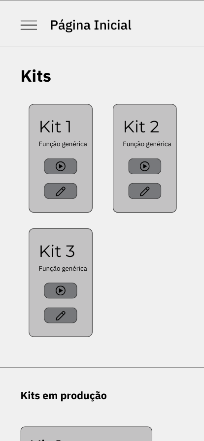

Fonte: Elaborado pela equipe Cardio-Bot

Tela 3 - Continuação da Página Inicial

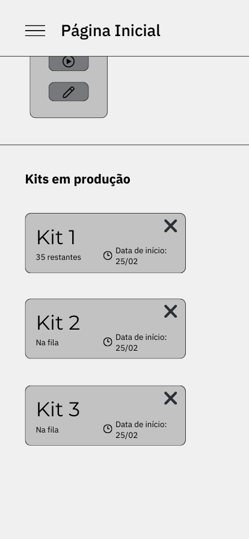

Fonte: Elaborado pela equipe Cardio-Bot

Tela 4 - Menu

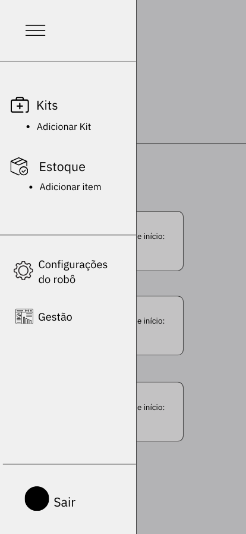

Fonte: Elaborado pela equipe Cardio-Bot

Tela 5 - Descrição do Kit

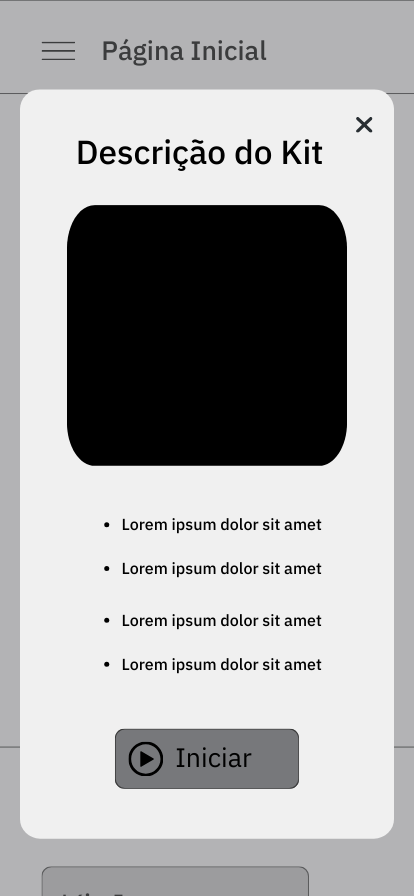

Fonte: Elaborado pela equipe Cardio-Bot

Tela 6 - Editar Kit

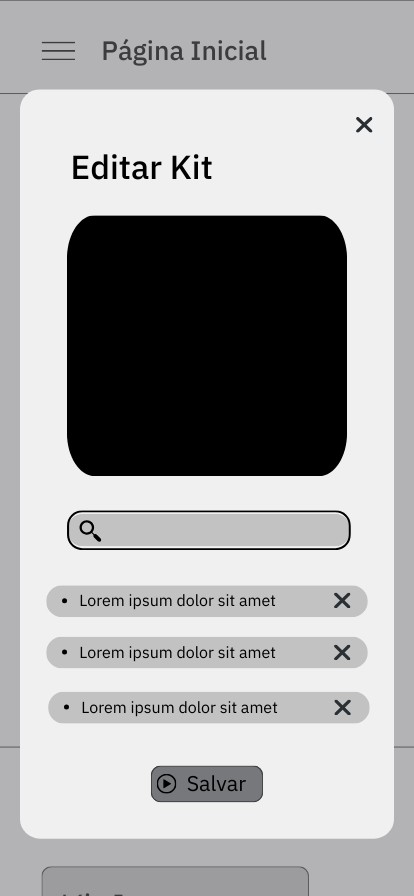

Fonte: Elaborado pela equipe Cardio-Bot

Tela 7 - Adicionar Kit

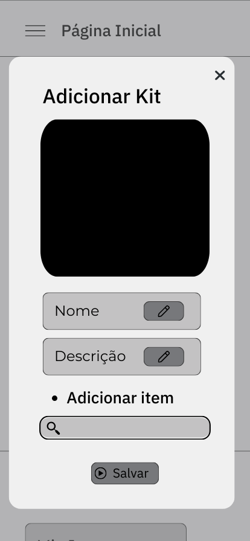

Fonte: Elaborado pela equipe Cardio-Bot

Tela 8 - Controle de estoque

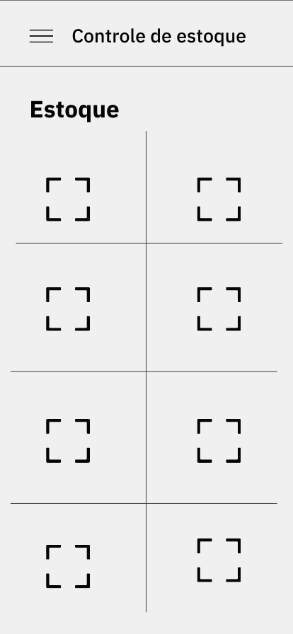

Fonte: Elaborado pela equipe Cardio-Bot

Tela 9 - Editar componente do estoque

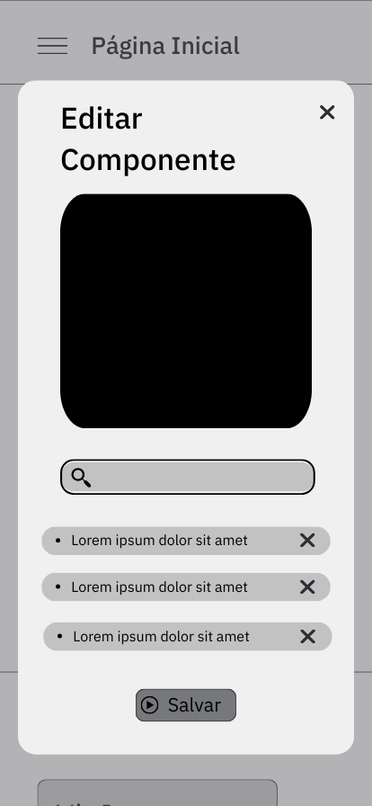

Fonte: Elaborado pela equipe Cardio-Bot

