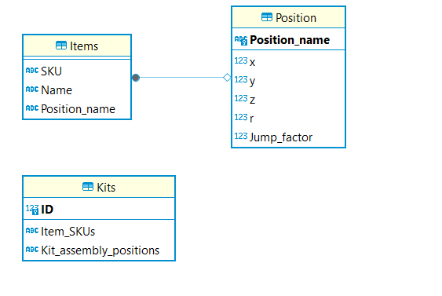

### Documentação da API para Controle de Braço Robótico e Integração com Dispositivos Externos

Esta API, desenvolvida com FastAPI, facilita a comunicação e o controle de um braço robótico Dobot, além de integrar-se com dispositivos como o Raspberry Pi Pico e câmeras para leitura de QR Codes. A API é projetada para executar tarefas como conectar ao robô, mover-se para posições específicas, capturar QR Codes e interagir com sensores.

#### Localização do Código da API e do Banco de Dados
- **Código**: `\2024-T0008-EC05-G05\src\backend\api\WebToRobot\app.py`
- **Banco de Dados**: SQLite, localizado em `\2024-T0008-EC05-G05\src\backend\database\dbCardioBot.db`

#### Estruturas das Tabelas do Banco de Dados
- **Items**: Armazena informações sobre itens individuais.
- **Kits**: Contém informações sobre os kits, conjuntos de itens.
- **Position**: Registra posições específicas para o movimento do robô.

Segue abaixo a estrutura do banco de dados:

#### Classe Dobot
Uma classe, `Dobot`, localizada em `dobot.py`, usa a biblioteca `pydobot` para controlar o braço robótico.

#### Endpoints da API

1. **Conectar ao Dobot**
   - **Endpoint**: `/conectar_dobot/`
   - **Método**: GET
   - **Parâmetro**: `porta` (string)
   - **Descrição**: Conecta o Dobot a uma porta especificada.

2. **Mover para Posições**
   - **Endpoint**: `/mover_para_posicoes/`
   - **Método**: GET
   - **Parâmetros**: `posicao_inicial`, `posicao_final` (strings)
   - **Descrição**: Move o Dobot entre posições, com verificações de sensor e leitura de QR Code.

3. **Capturar QR Code**
   - Método interno para capturar e decodificar QR Codes.

4. **Receber Dados do Raspberry Pi Pico**
   - **Endpoint**: `/pico_data`
   - **Método**: POST
   - **Descrição**: Recebe dados booleanos do Raspberry Pi Pico.

5. **Obter Dados Recebidos do Pico**
   - **Endpoint**: `/pico_data`
   - **Método**: GET
   - **Descrição**: Retorna os últimos dados recebidos do Pi Pico.

6. **Montar Kit**
   - **Endpoint**: `/montar_kit/`
   - **Método**: GET
   - **Parâmetro**: `kit_code` (string)
   - **Descrição**: Monta um kit baseado no código fornecido.

7. **Salvar Posição**
   - **Endpoint**: `/salvar_posicao/`
   - **Método**: GET
   - **Parâmetros**: `position_code` (string)
   - **Descrição**: Salva ou atualiza a posição atual do Dobot.

#### Rodando a API
1. Instalar dependências: `pip install -r requirements.txt` na pasta `\2024-T0008-EC05-G05\src\WebToRobot`.
2. Iniciar servidor: `uvicorn app:app --host 0.0.0.0 --reload --port 80`.
3. Acessar API: `http://<ip_do_computador>:80/docs`.

#### Registro de Logs
Um middleware registra os detalhes das requisições em um arquivo `request_log.json`.

#### Funções Adicionais
O código inclui funções para interação com o banco de dados SQLite, captura de imagens para leitura de QR Codes e mecanismos para comunicação com o Raspberry Pi Pico.