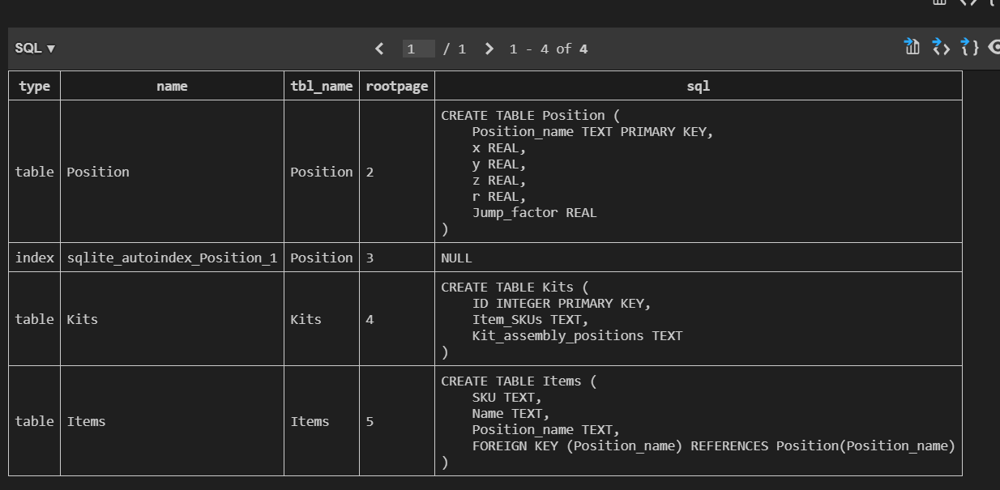
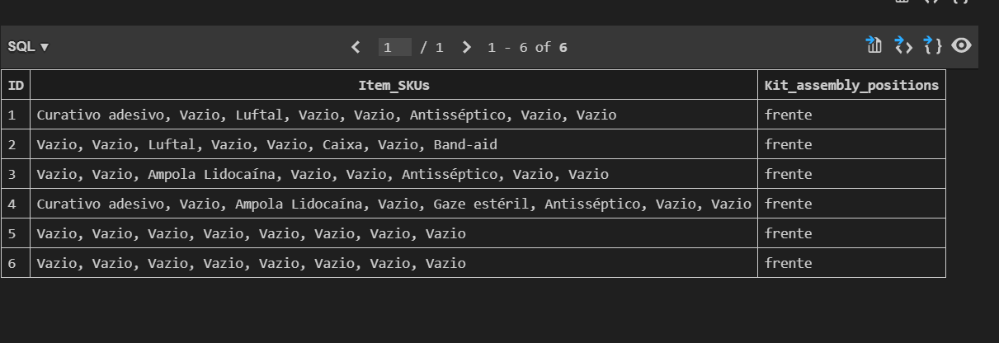

## Introdução
O objetivo principal do backend é aprimorar a interação entre o frontend e o banco de dados.
A solução para funcionar de forma correta necessita rodar diferentes backends e os avanços em relação aos mesmos serão descritos na seção abaixo.


### Backend Warehouse

Este backend tem como objetivo permitir a conexão da tela <code>/supplies</code> com o banco de dados. 

Em relação aos avanços desta sprint, o principal foi a mudança do banco de dados TinyDB para um banco de dados SQL relacional, o SQLite3. Tendo em mente o funcionamento do projeto, é primordial que os dados sigam uma estrutura consistente, e o SQLite transmite essa capacidade.

A maneira como a solução foi concebida é que, a partir da montagem dos kits, o robô já deve saber para onde ir. Assim, os dados são enviados com um padrão uniforme, facilitando a lógica desenvolvida na API do robô.

O banco de dados criado pode ser acessado em 

```
src\backend\database\dbCardioBot.db
```

Na imagem abaixo é possível conferir todas tabelas que foram desenvolvidas 




Já nesta imagem é possível conferir como os dados estão sendo salvos na tabela de Kits. 



### Backend Dashboard
