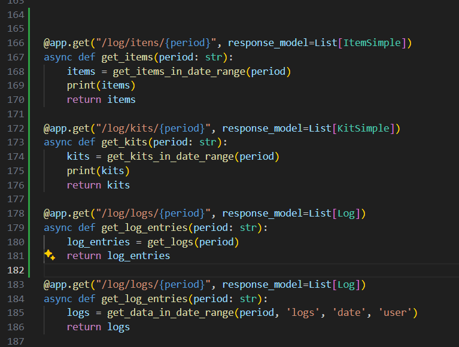
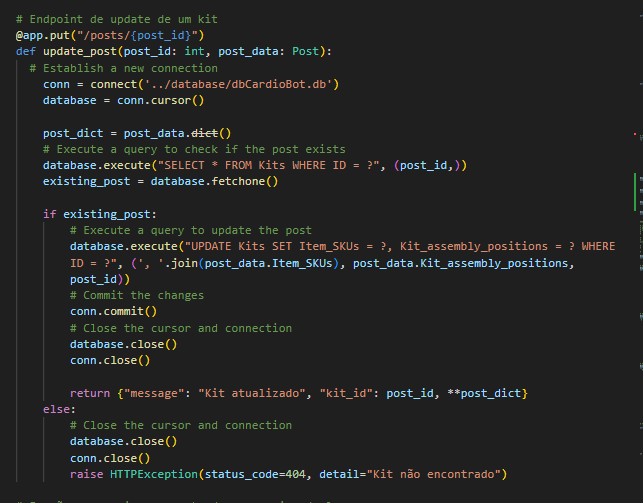
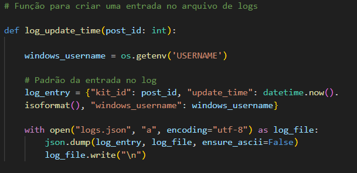

## Introdução

Nesta seção, você pode conferir a versão final do projeto e acompanhar as mudanças, bem como entender o funcionamento do backend.

O backend consiste em duas APIs desenvolvidas em Python utilizando o framework FastAPI. A escolha deste framework foi motivada pela sua capacidade de realizar requisições assíncronas e pela extensa documentação disponível, o que facilita o desenvolvimento e a manutenção do código.

Para acessar as APIs, basta navegar até a pasta src/backend/api, onde estão localizados os arquivos WebToRobot.py e Stock.py. Cada API possui uma função específica, detalhada ao longo desta documentação. Recomenda-se também explorar a seção de Arquitetura da Solução para obter uma visão macro do projeto.

## API WebToRobot 
to-do

## API Stock

A API do estoque é a responsável por todas as interações com o frontend. A ideia por trás dessa API é permitir a interação do frontend, sistema de logs e banco de dados.

#### Rotas da API

O código da API está dividido em três partes principais, cada um tem sua função única. 

##### Interação com o Dashboard

Esta parte da API fornece os logs para a tela do dashboard. Os logs são solicitados com base no período selecionado no dropdown, abrangendo itens individuais de cada kit, kits específicos e interações com o robô.

O código correspondente pode ser visualizado na imagem abaixo:

##### Interação com os kits 

A lógica pensada no desenvolvimento dos kits foi a de criar cinco kits padrões. A partir disso, o usuário pode atualizar a composição de cada um desses kits interagindo com os mesmos na tela de supplies. 

Na imagem abaixo é possível ver a rota de update.

##### Logs das alterações 

Manter a rastreabilidade é uma das funções mais importantes do projeto. Assim, foi desenvolvido um sistema de logs que mostra quem atualizou determinado kit, hora da alteração e qual kit foi modificado. 

É possível conferir o código na imagem abaixo. 

## Conclusão

Durante o desenvolvimento do backend, optamos por uma solução que permitisse o desacoplamento das partes e sistemas, evitando monolitos. O objetivo foi desenvolver duas APIs distintas: uma para comunicação com o robô e outra para interação com o frontend.

